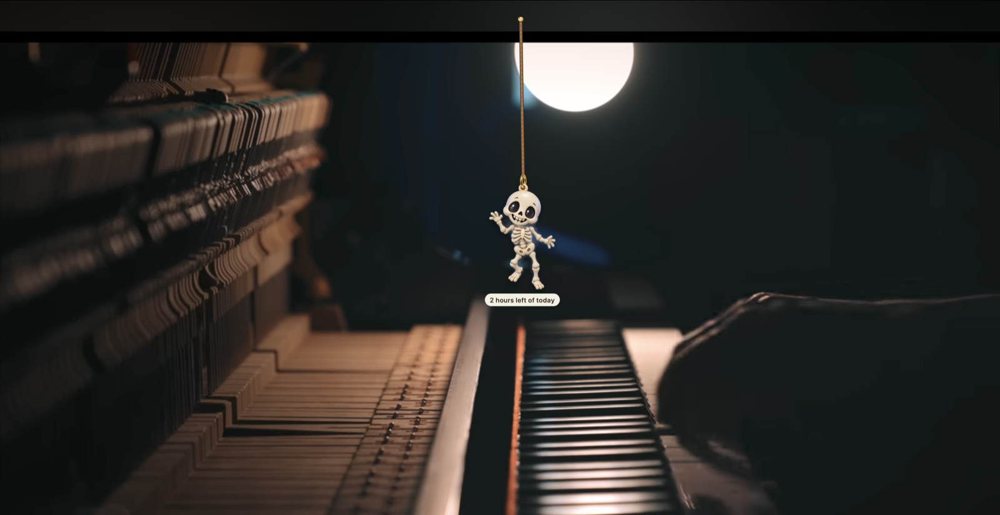
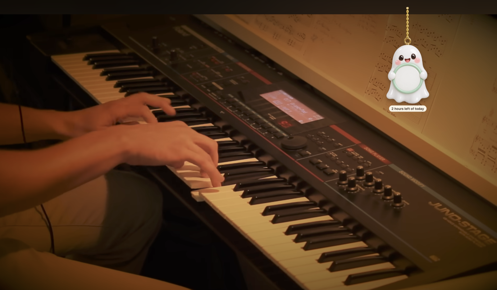

# Swaybles

Tiny charms that hang from the top of your Mac screen, swing with real rope physics, and cheer you on.
A gentle focus buddy, made for ADHD brains. Free and open source.


https://github.com/user-attachments/assets/83c76ddd-3cf0-400b-ad3a-4ef0acb147b8




- **Fidget toy:** flick a charm with your cursor, drag it, let it swing.
- **Focus timer:** tap Timer Ghost (or use the menu bar). When you finish, every charm does a happy wiggle.
- **Make the most of the next 90 days:** pick one goal; Banner Bat shows "Day 12 / 90". It's a calendar, not a
  streak, so nothing ever resets.
- **Private by design:** 100% offline. No data collected, ever — see [Privacy](#privacy).

## Install (no tech skills needed)

**[⬇ Download Swaybles](https://github.com/logrelu/swaybles/releases/latest/download/Swaybles.zip)** — Mac, macOS 14 or newer.

1. Double-click the downloaded **Swaybles.zip**.
2. Drag **Swaybles** into your **Applications** folder.
3. First launch only: macOS will say it "could not verify" the app (we haven't paid Apple for notarization — the
   code is all public, right here). Open **System Settings → Privacy & Security**, scroll down, click
   **Open Anyway**, and confirm.
4. Look up! The charms hang from the top of your screen, and Swaybles lives in the **menu bar** (top-right).



## Privacy

**Swaybles collects no data. None.**

- **It never connects to the internet.** There is no networking code in the app — no analytics, no crash
  reporting, no update checks, no "phoning home". You can block it with a firewall and nothing changes.
- **No account, no sign-up, no license key.** Download it and it's yours.
- **It can't see what you're doing.** Swaybles never reads your screen, your windows, your keystrokes or
  your files. The only things it knows are: the current time, the focus timer *you* start, and how long
  the mouse and keyboard have been idle (so the charms can doze while you're away).
- **Your photos stay home.** A photo you hang as a charm is copied into the app's own folder on your Mac
  and never leaves it.
- **Everything is stored locally** (your settings, goal and focus wins) and deleted with the app.

Don't take our word for it — this is the entire source code, right here in this repo.

## Run it from source (Mac, macOS 14+)

You need Xcode (free, Mac App Store).

```
cd mac
swift run Swaybles      # or: open Package.swift, then ⌘R in Xcode
swift test              # or ⌘U in Xcode
```

Swaybles lives in the menu bar (✨). Open **Swaybles Studio** from there (⌘,) to pick charms, set your 90-day goal
and choose a rope.

## Make a download

```
mac/scripts/make-app.sh     # → mac/dist/Swaybles-<version>.zip
```

Without a paid Apple Developer account the app isn't notarized, so the first launch is **right-click → Open**.

## Adding charms

Art comes from Imagine Art using the template in `docs/ART.md`. Save the PNG to `art/raw/<pack>/<id>.png`, add the
charm to `tools/packs.json`, then:

```
npm install          # once
npm run charms <pack>
npm run charms:review <pack>
```

## Repo map

| Folder | What |
|---|---|
| `mac/` | The app (Swift). See `CLAUDE.md` for the code map. |
| `docs/` | PRD, art spec, 90-day charm calendar |
| `tools/` | Art importer, contact sheet, promo-video recorder |
| `art/raw/` | Original Imagine Art images |
| `src/` | Old Electron version (kept for the art pipeline; being retired) |

Code: MIT. Charm images: see `ART-LICENSE`.
